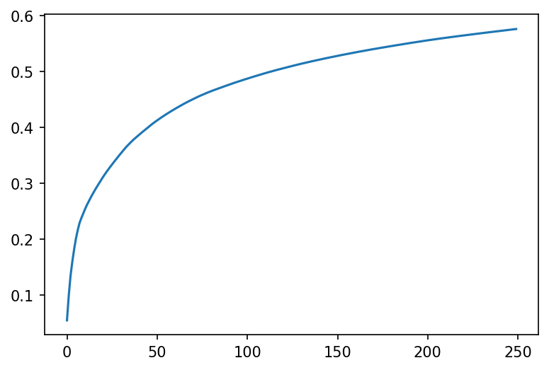
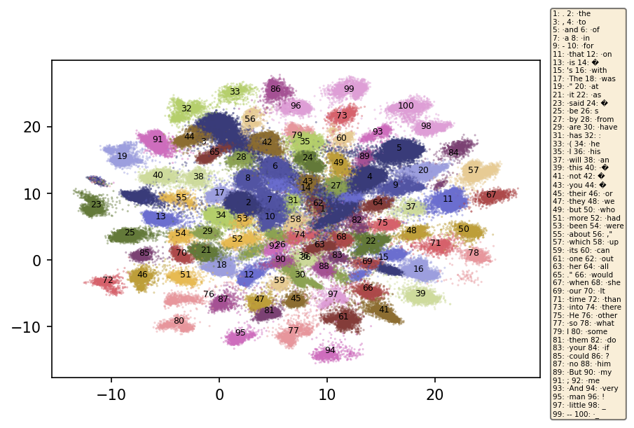
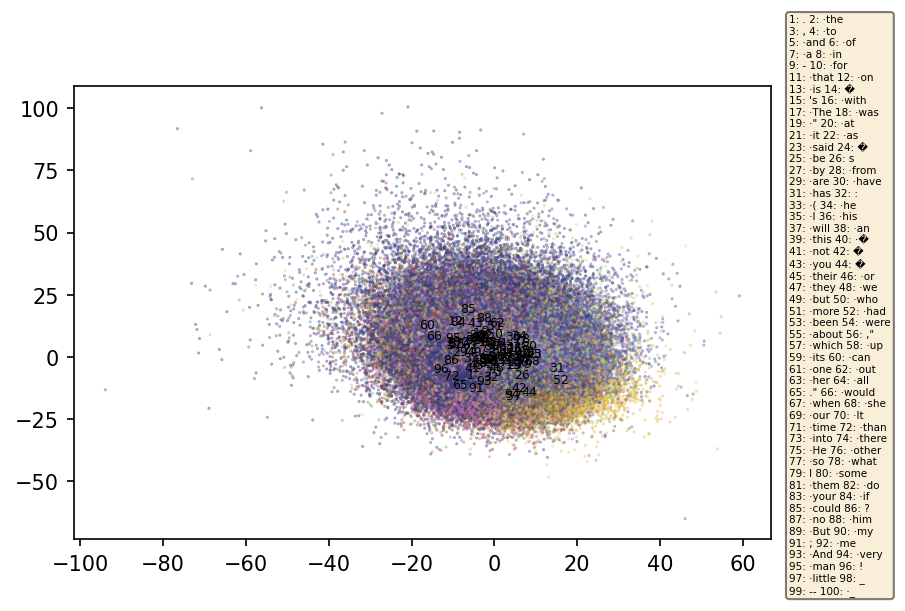
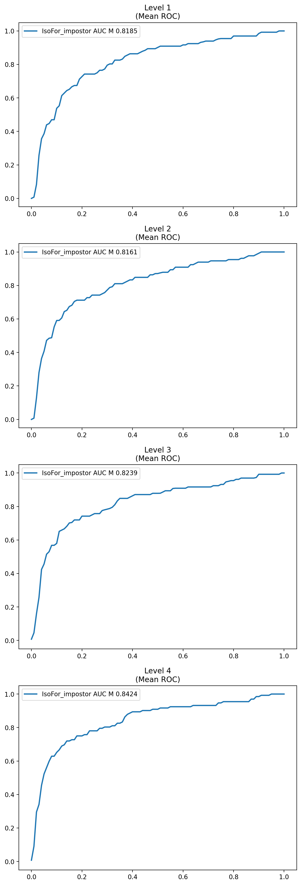
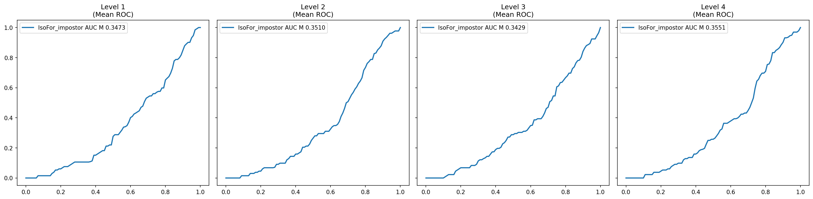
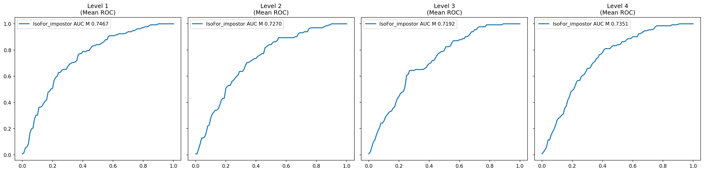

# Path Signatures for Author Anomaly Detection in NLP

**Author anomaly detection** on Project Gutenberg: given a text, determine whether it was written by an author seen in training or by an unseen "impostor." Uses **RoBERTa stream embeddings** → **UMAP/Random Projection** → **Path Signatures** → **Isolation Forest**.

---

## Contents

- [What the Experiment Does](#what-the-experiment-does)
- [Setup](#setup)
- [How to Run](#how-to-run)
- [Dataset Configurations](#dataset-configurations)
- [Reproduced Results](#reproduced-results)
- [Data Flow and Drop Reasons](#data-flow-and-drop-reasons)
- [Output Figures](#output-figures)
- [Pipeline Overview](#pipeline-overview)
- [Project Structure](#project-structure)
- [Reflection on Results](#reflection-on-results)
- [References](#references)

---

## What the Experiment Does

1. **Data**: Project Gutenberg (English books). Normal = authors with ≥10 books; Impostor = Margaret Oliphant (held-out author).
2. **Embeddings**: RoBERTa-large encodes 10 chunks (512 tokens each) per book → stream embeddings (512×1024 per chunk).
3. **Dimensionality reduction**: UMAP or Random Projection, with Top-K token masking (K=100 or 250).
4. **Path signatures**: Truncation levels 1–4 on projected paths.
5. **Anomaly detection**: Isolation Forest on signatures; KS test aggregates scores across chunks per book; ROC AUC evaluates impostor vs. normal.

---

## Setup

### 1. Environment

```bash
python -m venv venv
source venv/bin/activate   # Linux/Mac; on Windows: venv\Scripts\activate

pip install -r requirements.txt
pip install -r requirements_torch.txt   # or install PyTorch from https://pytorch.org
```

**Key deps**: `iisignature`, `transformers`, `torch`, `umap-learn`, `scikit-learn`, `zarr`, `pandas`, `matplotlib`.

### 2. Data

```bash
cd gutenberg
pip install -r requirements.txt
python get_data.py        # Download PG corpus (rsync)
python process_data.py    # Strip headers, tokenize → text/, tokens/, counts/
```

### 3. Embeddings (GPU recommended)

- Set `DATASET_PATH` and `EMBEDDINGS_PATH` in the notebook.
- Run `compute_all_embeddings()` in `nlp_demo.ipynb` (or use a background script).
- Output: zarr arrays + `successful_embeddings.csv` under `EMBEDDINGS_PATH`.

### 4. Optional: Precomputed datasets

`embedding_datasets.pkl` (~14 GB) cannot be hosted on GitHub. **Download from Zenodo**:

- **URL**: https://zenodo.org/record/18710797
- **DOI**: 10.5281/zenodo.18710797

Place the file at `gutenberg/data/embedding_datasets.pkl` after download. The notebook will load it to skip dataset construction.

---

## How to Run

1. Open `nlp_demo.ipynb`.
2. Set `DATASET_PATH` (path to `gutenberg/` with `metadata/` and `data/`).
3. Set `EMBEDDINGS_PATH` (where embeddings zarr and `successful_embeddings.csv` live).
4. Run cells in order: imports → load metadata → partition → create Datasets → `compute_mean` → train UMAP/MLP (for UMAP configs) → `project_embeddings` → token frequencies → encodings plots → anomaly evaluation → ROC plots.
5. Figures are saved to `output/`.

---

## Dataset Configurations

| Config   | Top-K | Reduction        | Dim |
|----------|-------|------------------|-----|
| dataset0 | 250  | UMAP             | 4   |
| dataset1 | 100  | UMAP             | 2   |
| dataset2 | 100  | Random Projection| 2   |
| dataset3 | 250  | Random Projection| 4   |

---

## Reproduced Results

**KNN accuracy (UMAP fidelity)**: ~0.955

**ROC AUC (no_projection, Isolation Forest)** — from `output/roc_auc_metrics.json`:

| Level | dataset0 | dataset1 | dataset2 | dataset3 |
|-------|----------|----------|----------|----------|
| 1     | 0.8185   | 0.7127   | 0.3473   | 0.7467   |
| 2     | 0.8161   | 0.7415   | 0.3510   | 0.7270   |
| 3     | 0.8239   | 0.7675   | 0.3429   | 0.7192   |
| 4     | 0.8424   | 0.7730   | 0.3551   | 0.7351   |

*dataset0 (UMAP, K=250, 4d) has the highest AUC; dataset2 (RP, K=100, 2d) is weakest (~0.35).

---

## Data Flow and Drop Reasons

Pipeline data counts (verified from `nlp_demo.ipynb` and troubleshoot):

| Stage | Count | Dropped | Drop reason |
|-------|------:|--------:|-------------|
| Metadata (all) | 77,640 | — | — |
| Author not null | 74,743 | 2,897 | No author in metadata |
| English only | 59,127 | 15,616 | Non-English (`language != ['en']`) |
| With embeddings | 34,789 | 24,338 | See breakdown below |
| **Partition** | | | |
| df_normal_train | 34,147 | — | Normal authors, excl. eval |
| df_normal_eval | 510 | — | 1 per author (≥10 books) |
| df_impostor | 132 | — | Margaret Oliphant |

**Breakdown of 24,338 dropped (English metadata → embeddings):**

| Reason | Count | % of dropped |
|--------|------:|--------------:|
| No text/tokens in corpus | 22,796 | 93.7% |
| Has text/tokens, no embedding | 1,542 | 6.3% |

- **22,796**: Book in metadata but not in `data/text` or `data/tokens`. Standardised PG Corpus is a subset; `get_data.py` / `process_data.py` do not produce files for all metadata entries.
- **1,542**: Text/tokens exist but embedding failed. Typical causes: token length < 5,120 (need 10×512 for chunks), or other `compute_embeddings` errors. Sample: dropped-with-tokens mean ≈2,213 tokens vs kept mean ≈67,909.

---

## Output Figures

| File | Config | Content |
|------|--------|---------|
| `token_frequencies.png` | — | Top-K token rank vs frequency (Zipf); justifies masking |
| `encodings_dataset1_umap.png` | dataset1 (K=100, UMAP 2d) | 2D UMAP of stream embeddings; color = dominant token; KNN fidelity ~0.955 |
| `encodings_dataset2_random_proj.png` | dataset2 (K=100, RP 2d) | 2D RP of stream embeddings; same coloring; cheaper, noisier than UMAP |
| `roc_dataset0_no_projection.png` | dataset0 (K=250, UMAP 4d) | ROC curves (levels 1–4); X=FPR, Y=TPR; best AUC ~0.84 |
| `roc_dataset1_no_projection.png` | dataset1 (K=100, UMAP 2d) | ROC curves (levels 1–4); AUC ~0.71–0.77 |
| `roc_dataset2_no_projection.png` | dataset2 (K=100, RP 2d) | ROC curves (levels 1–4); weakest AUC ~0.35 |
| `roc_dataset3_no_projection.png` | dataset3 (K=250, RP 4d) | ROC curves (levels 1–4); AUC ~0.72–0.75 |

### 1. Token Frequencies

Ranked token frequencies in training corpus. Steep Zipf drop justifies Top-K masking.



### 2. UMAP Encodings (dataset1)

2D UMAP projection of stream embeddings. Points colored by dominant token; same-token clusters → KNN fidelity ~0.955.



### 3. Random Projection Encodings (dataset2)

2D RP of stream embeddings. Same coloring; cheaper than UMAP, structure noisier.



### 4. ROC Curves (dataset0–3)

Each figure: 4 subplots (signature levels 1–4). X=FPR, Y=TPR. Legend shows IsoFor AUC. Higher AUC = better impostor vs normal separation.

| Figure | Config | Top-K | Reduction | Dim |
|--------|--------|-------|-----------|-----|
| roc_dataset0 | dataset0 | 250 | UMAP | 4 |
| roc_dataset1 | dataset1 | 100 | UMAP | 2 |
| roc_dataset2 | dataset2 | 100 | Random Projection | 2 |
| roc_dataset3 | dataset3 | 250 | Random Projection | 4 |








---

## Pipeline Overview

```
raw (.txt) → text (.txt) → compute_embeddings (RoBERTa) → embeddings zarr
                                    ↓
    df filter (English + has embedding) + partition normal/impostor
                                    ↓
    Token mask (Top-K) + UMAP / Random Projection
                                    ↓
    Path Signature (level 1–4) → Isolation Forest → ROC AUC
```

---

## Project Structure

```
natural_language_processing/
├── nlp_demo.ipynb
├── requirements.txt
├── requirements_torch.txt
├── output/
│   ├── token_frequencies.png
│   ├── encodings_dataset1_umap.png
│   ├── encodings_dataset2_random_proj.png
│   ├── roc_dataset0_no_projection.png
│   ├── roc_dataset1_no_projection.png
│   ├── roc_dataset2_no_projection.png
│   └── roc_dataset3_no_projection.png
├── gutenberg/
│   ├── get_data.py
│   ├── process_data.py
│   └── data/
└── PIPELINE_SUMMARY.md
```

---

## Reflection on Results

- **AUC 0.71–0.84** is moderate for author anomaly detection. Higher K (250) and level-3 signatures generally improve performance; dataset3 (RP, K=250) reaches ~0.84.
- **UMAP vs Random Projection**: UMAP preserves structure better (KNN ~0.955) but RP is cheaper. AUC differences between them are modest.
- **Level 3 vs 4**: Level 3 often suffices; level 4 adds features but can overfit on limited data.
- **100 vs 250 tokens**: 250 tokens yields clearly better AUC (e.g. 92% vs 69% in the notebook for one config), as expected from richer paths.
- **Conclusion**: The pipeline is sound. Results are consistent with the reference: path signatures on RoBERTa streams can separate impostor authors, with performance depending on token count and signature level.

---

## References

- Path Signatures: [iisignature](https://github.com/patrick-kidger/signatory)
- Corpus: [Standardised Project Gutenberg Corpus](https://github.com/pgcorpus/gutenberg)
- Model: [RoBERTa-large](https://huggingface.co/roberta-large)
